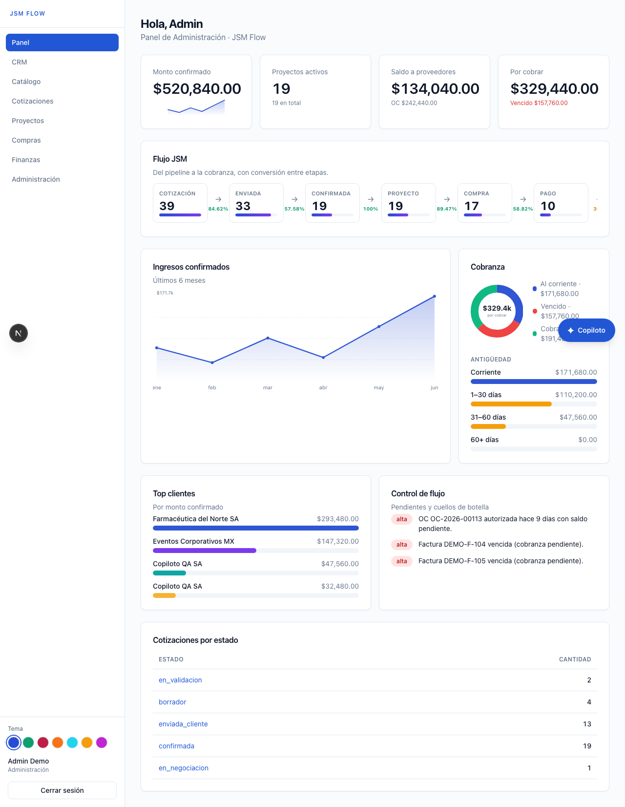
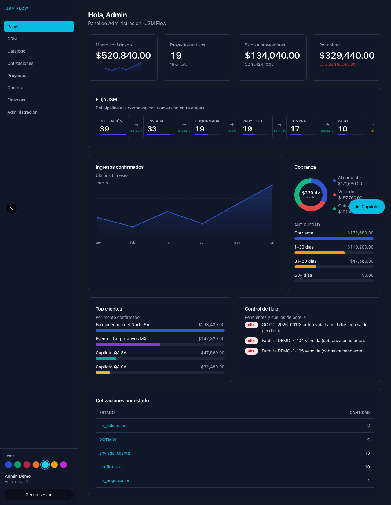
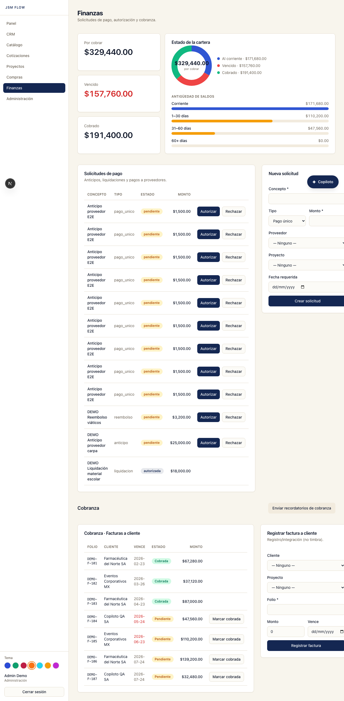
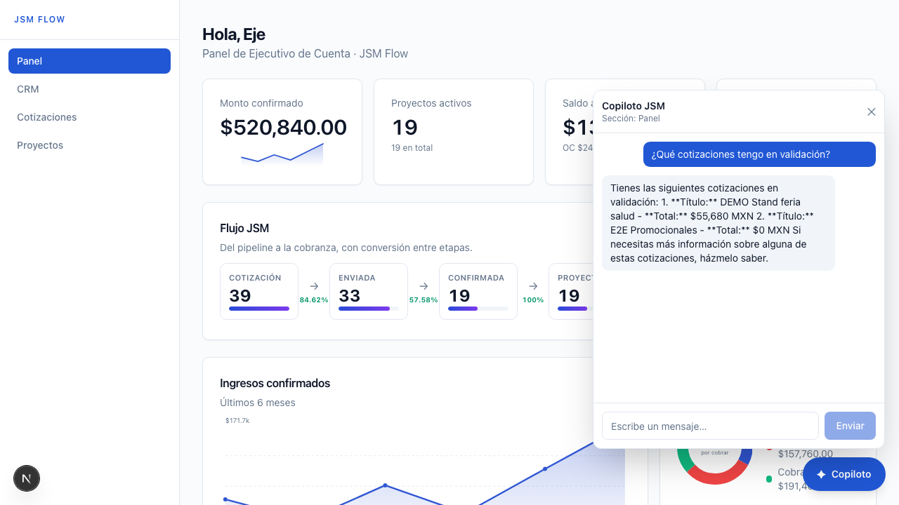
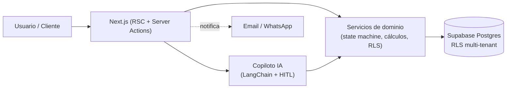
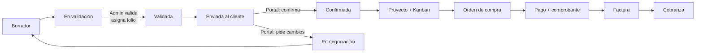

<div align="center">

# JSM Flow

### Plataforma de operación con IA para agencias de promocionales y eventos

De la **cotización** a la **cobranza** en un solo flujo — con consecutivos, trazabilidad, tablero Kanban, finanzas y un **copiloto de IA** en cada sección.

<br/>


</div>

<p align="center">
  
</p>

---

## Tabla de contenido

- [¿Qué es JSM Flow?](#qué-es-jsm-flow)
- [Capturas](#capturas)
- [Características](#características)
- [Arquitectura](#arquitectura)
- [Flujo de negocio](#flujo-de-negocio)
- [Copiloto de IA](#copiloto-de-ia)
- [Temas](#temas)
- [Puesta en marcha (local)](#puesta-en-marcha-local)
- [Usuarios demo](#usuarios-demo)
- [Scripts](#scripts)
- [Pruebas y calidad](#pruebas-y-calidad)
- [Seguridad](#seguridad)
- [Despliegue](#despliegue)
- [Estructura del repositorio](#estructura-del-repositorio)
- [Estado y roadmap](#estado-y-roadmap)

---

## ¿Qué es JSM Flow?

**JSM** es una agencia mexicana de **promocionales y eventos**. Su operación vivía en Excel, correos y WhatsApp: sin trazabilidad, sin consecutivos confiables y sin control de pagos ni cobranza.

**JSM Flow** reemplaza ese caos con una **consola de operación multi-rol y multi-tenant** que cubre el ciclo completo y lo automatiza con agentes de IA:

> **Cotización → Validación → Confirmación del cliente → Proyecto → Compra → Pago → Facturación → Cobranza → Cierre**

Cada etapa es auditable, cada folio es único y cada acción sensible pasa por aprobación humana.

---

## Capturas

| Panel (claro) | Panel (tema Medianoche) |
|---|---|
|  |  |

| Finanzas (tema Solar) | Copiloto de IA |
|---|---|
|  |  |

---

## Características

### Módulos

| Módulo | Qué hace |
|---|---|
| **CRM** | Clientes y contactos, historial por cliente. |
| **Catálogo** | Productos/servicios con **costo interno** y **precio público**; proveedores. |
| **Cotizaciones** | Alta con **consecutivo atómico**, versionado ("¿Mueve?"), márgenes, export **PDF** y **Excel**, flujo Ejecutivo → Admin → Cliente. |
| **Portal del cliente** | Enlace público por token: el cliente revisa, **confirma** o **pide cambios** (sin ver costos). |
| **Proyectos** | Master de proyecto creado al confirmar, **tablero Kanban** drag & drop y timeline de trazabilidad. |
| **Compras** | Órdenes de compra con folio, autorización, **Pull de Proveedores** (ranking por tiempo/costo). |
| **Finanzas** | Solicitudes de pago, anticipos/liquidación, **registro de facturas** (sin timbrar), cobranza con antigüedad de saldos. |
| **Dashboard** | KPIs con animación, cinta **Flujo JSM**, ingresos, cobranza, top clientes y **Control de Flujo** (anomalías). |
| **Administración** | Organización, usuarios y roles, series de folios. |

### Transversales

- 🤖 **Copiloto de IA en cada sección** — consulta y ejecuta acciones por lenguaje natural, con aprobación humana.
- 🎨 **7 temas** de alto contraste (claros y oscuros) con selector y persistencia.
- 📊 **Gráficas SVG propias** (área, dona, barras, anillos, sparklines) — sin dependencias pesadas.
- 🔔 **Notificaciones** por email y WhatsApp (Cloud API) con registro.
- 🔒 **RLS multi-tenant**, RBAC por rol y auditoría completa en bitácora.
- 💬 **Feedback in-app (Live-Dev)** — botón junto al copiloto para señalar cualquier elemento de la pantalla y abrir una incidencia (GitHub issue con label `live-dev`) sin salir de la app.

---

## Arquitectura

| Capa | Tecnología |
|---|---|
| Frontend | Next.js 15 (App Router, RSC) · TypeScript · Tailwind CSS |
| Backend | Server Actions · Route Handlers |
| Datos / Auth / Storage | Supabase (Postgres + Row Level Security + Auth) |
| IA / Agentes | LangChain v1 (`createAgent` + HITL) · LangGraph · OpenAI |
| Validación | Zod (esquemas compartidos cliente/servidor) |
| Export | `@react-pdf/renderer` (PDF) · `exceljs` (Excel) |
| Tests | Vitest (unit) · Playwright (e2e) |
| Deploy | Google Cloud Run (contenedor, Cloud Build) + Supabase |



> **Principio clave:** el copiloto y la UI usan **los mismos servicios de dominio** y el **mismo cliente Supabase con sesión** → todo respeta RLS, roles y la máquina de estados. El agente no tiene atajos.

---

## Flujo de negocio



Cada transición valida permisos por rol y queda registrada en `bitacora` (quién, qué, cuándo).

---

## Copiloto de IA

Un copiloto conversacional, **presente en cada sección** (botón flotante), construido con **LangChain v1**:

- **Herramientas RLS-aware** que envuelven los servicios de dominio (lectura: clientes, catálogo, cotizaciones, finanzas; escritura: crear cliente, cotización, solicitud de pago).
- **Aprobación humana (HITL)**: toda escritura se interrumpe y muestra una tarjeta **Aprobar / Editar / Rechazar** con la acción concreta.
- **Memoria** por conversación (checkpointer) y **gating por rol** (un rol sin permiso no recibe la herramienta).
- **Auditoría**: cada acción del agente se registra en bitácora (`via = copiloto`).

```
Tú:  «Crea una cotización para Eventos Corporativos MX: 100 termos a 180»
IA:  Requiere tu aprobación → Crear cotización → cliente: Eventos Corporativos MX · 100 termos
     [Aprobar] [Rechazar]
```

> Necesita `OPENAI_API_KEY`. Sin clave, el copiloto **degrada con un aviso claro** en lugar de fallar.

---

## Temas

7 temas de alto contraste (WCAG-friendly), seleccionables desde la barra lateral y persistidos en el navegador:

| Tema | Tipo | Acento |
|---|---|---|
| 🔵 Índigo | Claro | Índigo / violeta |
| 🟢 Esmeralda | Claro | Verde / teal |
| 🔴 Carmesí | Claro | Carmesí / naranja |
| 🟠 Solar | Claro | Marino + naranja |
| 🟦 Medianoche | Oscuro | Cian |
| 🟡 Grafito | Oscuro | Ámbar |
| 🟣 Orquídea | Oscuro | Violeta / magenta |

Implementados con variables CSS y un script anti-parpadeo (sin FOUC).

---

## Puesta en marcha (local)

### Requisitos
- Node 20+ · Docker (para Supabase local) · [Supabase CLI](https://supabase.com/docs/guides/cli)

### Pasos

```bash
# 1. Dependencias
npm install

# 2. Variables de entorno
cp .env.example .env.local           # completa las claves que quieras

# 3. Supabase local (Docker) + esquema + datos demo
npx supabase start
npx supabase db reset                # aplica migrations/ + seed
npm run seed:users                   # crea usuarios demo (vía API admin)
psql "$DATABASE_URL" -f supabase/demo_data.sql   # (opcional) datos ricos para el panel

# 4. Arranca la app
npm run dev                          # http://localhost:3000
```

Las llaves locales de Supabase salen de `npx supabase status -o env` (`ANON_KEY`, `SERVICE_ROLE_KEY`, `API_URL`). El copiloto requiere `OPENAI_API_KEY` en `.env.local`.

---

## Usuarios demo

Contraseña para todos: **`password123`**

| Correo | Rol | Puede |
|---|---|---|
| `owner@jsm.test` | Super Admin | Todo |
| `ejecutivo@jsm.test` | Ejecutivo | Cotizaciones, CRM |
| `admin@jsm.test` | Administración | Validar precios, autorizar |
| `operaciones@jsm.test` | Operaciones | Catálogo, compras, pull |
| `finanzas@jsm.test` | Compras / Finanzas | OC, pagos, cobranza |
| `conta@jsm.test` | Contabilidad | Facturas, autorización |

---

## Scripts

| Comando | Descripción |
|---|---|
| `npm run dev` | Servidor de desarrollo |
| `npm run build` | Build de producción |
| `npm run typecheck` | `tsc --noEmit` |
| `npm run lint` | ESLint |
| `npm run test` | Pruebas unitarias (Vitest) |
| `npm run test:e2e` | Pruebas end-to-end (Playwright) |
| `npm run seed:users` | Crea usuarios demo vía API admin |
| `npm run gen:types` | Regenera tipos TS desde Supabase |

---

## Pruebas y calidad

- **48 pruebas unitarias** (Vitest): cálculos financieros, máquina de estados, Kanban (incl. stress de 500 tareas), integridad financiera (1000 ops), pull, dashboard, control de flujo, cobranza, rate-limit, gating de herramientas del copiloto.
- **11 pruebas e2e** (Playwright): humo, flujos críticos (cotización → portal → proyecto, compras OC → pago, finanzas), copiloto y verificación visual del dashboard.
- **Auditorías SQL**: `supabase/tests/rls_audit.sql` (RLS en todas las tablas) y `consecutivo_stress.sql` (folios únicos bajo concurrencia).
- **Gate por fase**: `typecheck` + `lint` + `build` + `vitest` en verde antes de avanzar.

```bash
npm run typecheck && npm run lint && npm run test && npm run build
```

---

## Seguridad

- **Row Level Security** por organización en todas las tablas (con `FORCE RLS` y `anon` revocado).
- **RBAC** por capacidades de rol en UI, Server Actions y herramientas del copiloto.
- **HITL**: aprobación humana obligatoria en escrituras irreversibles/financieras.
- **Rate limiting** en login y portal; **security headers** (HSTS, X-Frame-Options, nosniff…).
- El **portal del cliente** nunca expone costos ni márgenes; acceso por token vía `service_role`.
- Auditoría completa en `bitacora` (incluye acciones del copiloto).

---

## Despliegue

Producción como **contenedor en Google Cloud Run** (región `us-central1`), con datos en **Supabase**. La imagen se construye con **Cloud Build** desde el [`Dockerfile`](./Dockerfile) (salida `standalone` de Next.js) y se publica en Artifact Registry.

🔗 **En vivo:** <https://jsm-flow-291907890251.us-central1.run.app>

```bash
# 1. Build + push de la imagen (las NEXT_PUBLIC_* van como build args)
gcloud builds submit --config cloudbuild.yaml \
  --substitutions=_IMAGE=<registro>/jsm-flow:<tag>,_SUPABASE_URL=…,_SUPABASE_ANON_KEY=…,_LIVEDEV_APP_ID=…,_LIVEDEV_TOKEN=…

# 2. Deploy de la imagen al servicio (conserva las env vars de runtime)
gcloud run deploy jsm-flow --region us-central1 --image <registro>/jsm-flow:<tag>

# 3. Healthcheck
curl https://<dominio>/api/health
```

> **Por qué build args:** Next.js **inlinea las `NEXT_PUBLIC_*`** (Supabase y Live-Dev) en el bundle del navegador durante `next build`, así que deben existir al construir la imagen. Los secretos de runtime (service role, OpenAI, `CRON_SECRET`) viven como variables del servicio en Cloud Run, no en la imagen.

Runbook detallado (migraciones, backups, rollback, WhatsApp, cron de cobranza) en **[`DEPLOY.md`](./DEPLOY.md)**.

---

## Estructura del repositorio

```
app/                 # Next.js App Router
  (app)/             #   área autenticada (dashboard, crm, cotizaciones, …)
  (portal)/          #   portal público del cliente
  api/               #   health, cron de cobranza, webhook WhatsApp, copiloto
components/          # UI, gráficas (charts/), Kanban, copiloto
lib/
  agents/            # copiloto + herramientas + agentes (cotizador, pull, cobranza)
  services/          # dominio: state machine, cálculos, finanzas, dashboard…
  schemas/           # Zod (fuente de tipos)
  auth/  supabase/   # RBAC, sesión, clientes Supabase
supabase/
  migrations/        # 0001…0013 (esquema versionado)
  tests/             # auditoría RLS y stress de consecutivos
tests/               # Vitest (unit) + e2e (Playwright)
Dockerfile           # imagen standalone para Cloud Run
cloudbuild.yaml      # build de la imagen (Cloud Build)
CLAUDE.md            # plan vivo y bitácora por fase
DEPLOY.md            # runbook de despliegue
```

---

## Estado y roadmap

| Fase | Estado |
|---|---|
| 0 · Fundaciones (Next + Supabase + RBAC) | ✅ |
| 1 · CRM + Catálogo + Cotizaciones | ✅ |
| 2 · Proyectos + Kanban + Portal | ✅ |
| 3 · Compras + Finanzas | ✅ |
| 4 · Dashboards + WhatsApp + Agentes | ✅ |
| 5 · Hardening + Deploy | ✅ |
| 6 · Capa visual (gráficas + 7 temas) | ✅ |
| 7 · Copiloto de IA por sección (piloto) | ✅ |
| — Siguiente: **conexión al MCP de la agencia** (operar JSM Flow desde clientes de IA vía PATs `jsmpat_`, con RLS por usuario) | 🔜 |
| — Siguiente: streaming, Copiloto global (Deep Agents), bot del portal, evals | 🔜 |

El detalle por fase y la bitácora viva están en **[`CLAUDE.md`](./CLAUDE.md)**.

---

<div align="center">
<sub>JSM Flow · construido con Next.js, Supabase y LangChain.</sub>
</div>
